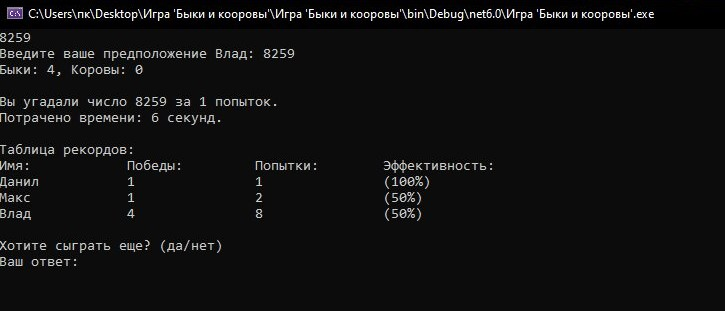

# BullsAndCows



## Описание игры:

Игра 'Быки и коровы' - классическая настольная игра, также популярная в виде интеллектуальной головоломки для одного игрока.
Задача игроков — угадать секретное число, которое загадано программой.

## Правила игры:

1. Выбор числа:

```-Компьютер загадывает секретное четырёхзначное число. Все цифры в числе не должны повторяться.```

Например, число может быть "1234", но не "1123".

2. Процесс игры:

```-Игрок пытается угадать это число, вводя свои предположения.```

```-После каждой попытки, компьютер сообщает количество "быков" и "коров".```

3. Определения:

```-Бык — цифра стоит на правильной позиции.```

```-Корова — цифра есть в числе, но стоит не на своём месте.```

Пример:

Загадано число "4271".

Попытка угадывающего: "1234".

Результат: 1 бык (цифра "2" на правильной позиции) и 2 коровы (цифры "4" и "1" не на своих местах).

4. Завершение игры:

```-Игра продолжается до тех пор, пока угадывающий не введет загаданное число правильно. В этом случае он получает 4 быка.```

## Примечания:

```-Для добавления нового игрока небходимо сначала добавить его в файл users.txt или зайти в учетную запись Admin, испоьзуя пароль "666" и уже добавить пользователя в самой программе.```

```-Путь до users.txt: ./Игра 'Быки и коровы/bin/Debug/net6.0/results.txt'```

## Генерация числа:


## Документация

Пользовательскую документацию можно получить по [этой ссылке](./Readme.md).